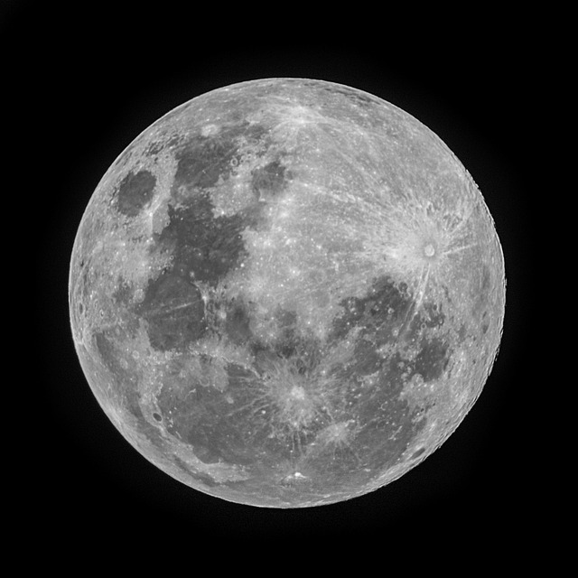
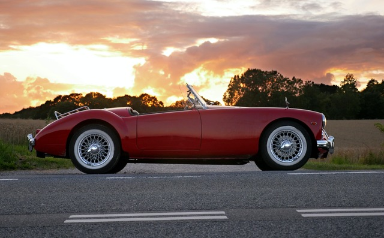
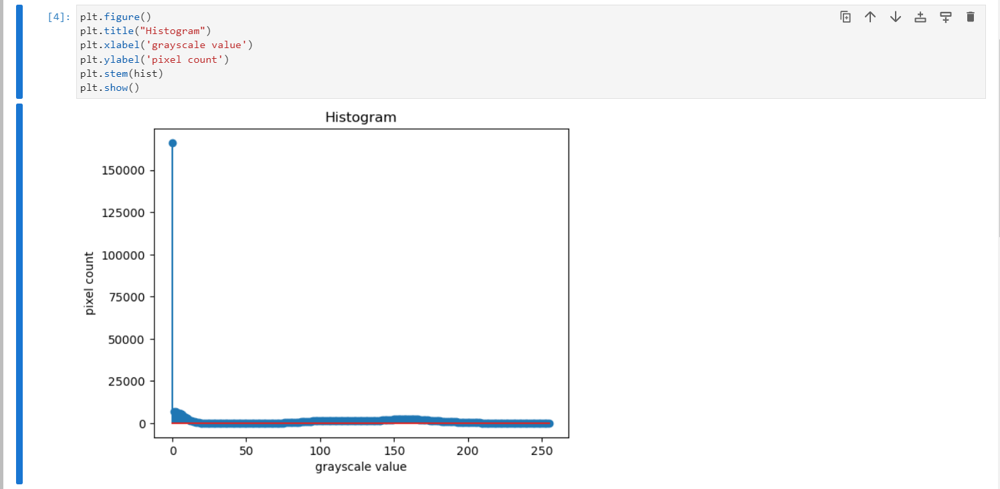
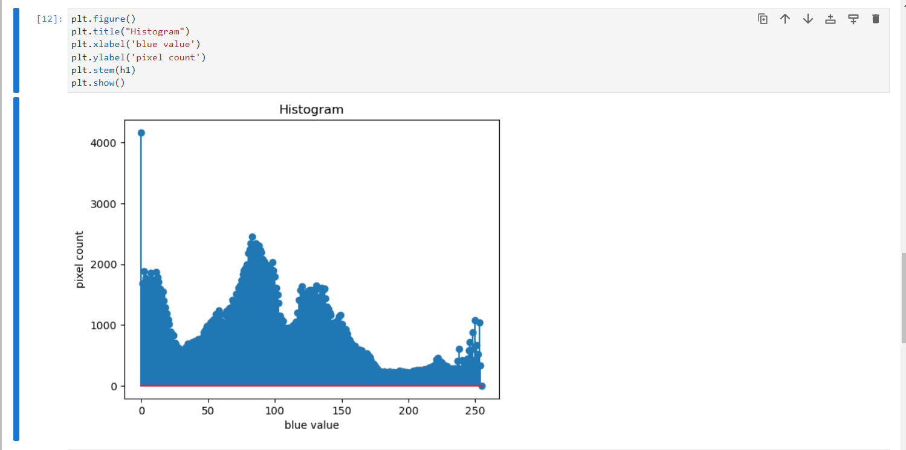
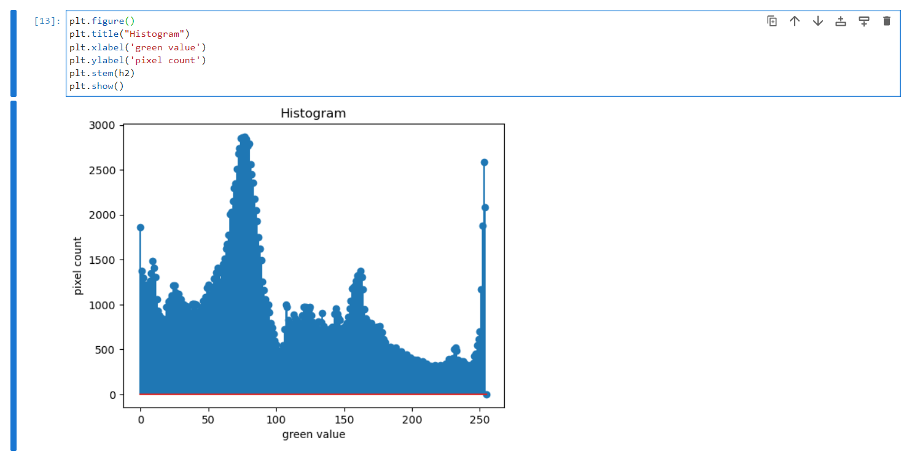
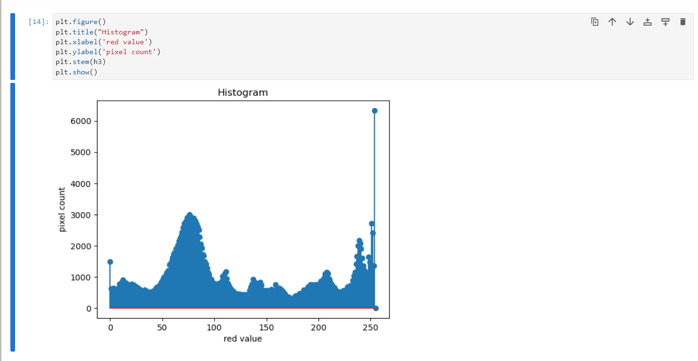
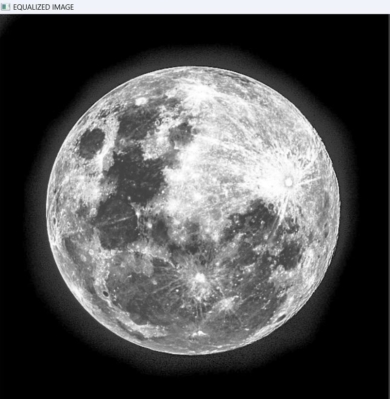

# Histogram and Histogram Equalization of an image
## Aim
To obtain a histogram for finding the frequency of pixels in an Image with pixel values ranging from 0 to 255. Also write the code using OpenCV to perform histogram equalization.

## Software Required:
Anaconda - Python 3.7

## Algorithm:
### Step1:
Import the necessary libraries and read two images, Color image and Gray Scale image.<br>


### Step2:
Calculate the Histogram of Gray scale image and each channel of the color image.<br>

### Step3:
Display the histograms with their respective images.<br>

### Step4:
Equalize the grayscale image.<br>

### Step5:
Display the grayscale image.<br>

## Program:


### Developed By: Pranave B
### Register Number: 212221240040

```python
import cv2
import matplotlib.pyplot as plt
```
## Write your code to find the histogram of gray scale image and color image channels.

### Gray Image
```python
hist = cv2.calcHist([gray_image],[0],None,[256],[0,255])
```
### Color Image 

#### Chanel Blue
```python
h1 = cv2.calcHist([color_image],[0],None,[256],[0,255]) 
```
#### Chanel Green
```python
h2 = cv2.calcHist([color_image],[1],None,[256],[0,255]) 
```
#### Chanel Red
```python
h3 = cv2.calcHist([color_image],[2],None,[256],[0,255]) 
```


## Display the histogram of gray scale image and any one channel histogram from color image


### Gray Image
```python
import cv2
import matplotlib.pyplot as plt
gray_image =cv2.imread('M640.png',0)
cv2.imshow('gray_image',gray_image) 
cv2.waitKey(0) 
cv2.destroyAllWindows()
```
### Color Image
```python
import cv2
import matplotlib.pyplot as plt
color_image =cv2.imread('red_car.png',-1)
cv2.imshow('color_image',color_image) 
cv2.waitKey(0) 
cv2.destroyAllWindows()
```


## Write the code to perform histogram equalization of the image.
```python
equ_img = cv2.equalizeHist(gray_image)
```


# Output:
## Input Grayscale Image and Color Image

<br>
<br>


## Histogram of Grayscale Image and any channel of Color Image
#### Grey Image
 <br>
#### Blue Channel
 <br>
#### Green Channel
 <br>
#### Red Channel
 <br>

## Histogram Equalization of Grayscale Image
 <br>


# Result: 
Thus the histogram for finding the frequency of pixels in an image with pixel values ranging from 0 to 255 is obtained. Also,histogram equalization is done for the gray scale image using OpenCV.
